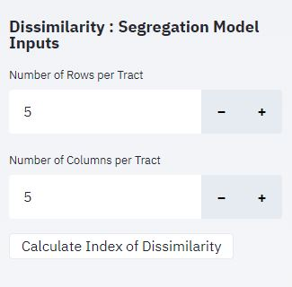
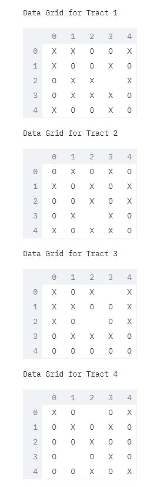
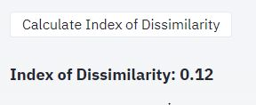
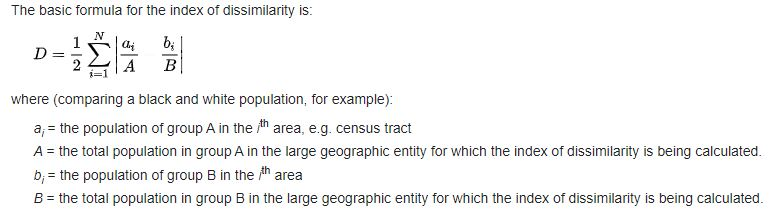
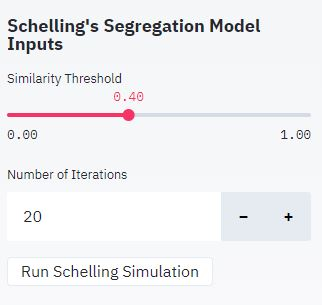
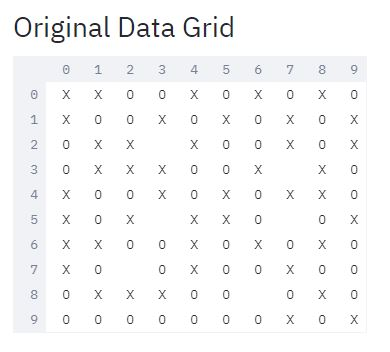
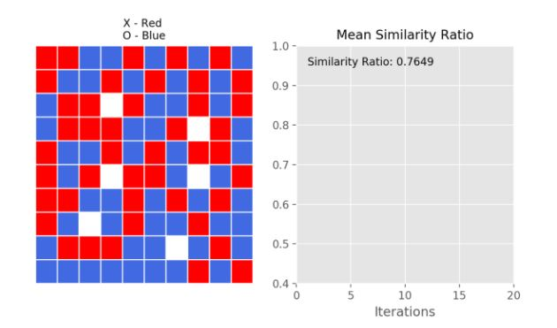
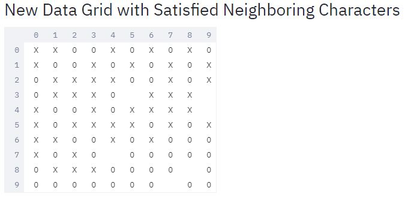

# Segregation Models
## Introduction
### Index of Dissimilarity (D) : Segregation Model
The Index of Dissimilarity is the most common measure of segregation. Although it has imitations, it is relatively easy to calculate and to interpret. It is a comparison between two groups/types and measures their relative separation (high dissimilarity) or integration (low dissimilarity) across all neighborhoods in an area (in this case a data grid).

The dissimilarity index (**D**) varies between 0% and 100%, and measures the percentage of one group that would have to move across neighborhoods to be distributed the same way as the second group. (It is a symmetrical measure so that this interpretation can apply to either group). A dissimilarity index of 0% indicates conditions of total integration under which both groups are distributed in the same proportions across all neighborhoods. A dissimilarity index of 100% indicates conditions of total segregation such that the members of one group are located in completely different neighborhoods than the second group.

### Schelling's Segregation Model
Schelling's model is the mathematical version of the saying "birds of the same feather flocks together". In this simulation, an agent is happy or satisfied when it's closest neighbor is the same class as to itself.

The idea behind the Schelling Model is that we create an M x N grid from our data file (**Input_data.csv**) that contains homes/cells for our agents, which we simulate to belong to different char/types (*in this case X and O only*), with a certain possibility that cells are empty.

In each iteration we calculate a ratio of same-race neighbors over the total amount neighbors for each home (position on the grid). If the ratio falls below a certain threshold (*depends on the user input*), the agent becomes dissatisfied and will move to another (random) home/cell. This process is iterated to find a possible state of equilibrium with the largest mean similarity ratio.

## Instructions to run the application
1. This application is executed and wrapped via [Streamlit](https://www.streamlit.io/).
2. There are 2 methods to run it:
   - Docker container
   - Command Line Interface/Terminal

### Docker container
Prerequisites:
1. Your testing environment should have Docker installed already.
2. Docker daemon service is running.
*To know more about docker, visit [Docker website](https://docs.docker.com/)*

Step by Step Process:
1. From the project directory, run **`docker image build -t st:app .`**
2. Allow all the installations to finish.
3. Once done with docker image build, execute **`docker container run -p 8501:8501 st:app`**
3. After running the app via docker container, you can access it in [localhost](http://localhost:8501).

### CLI/Terminal
Prerequisites:
1. Your testing environment should install dependencies and libraries first. Above all, Python 3 and up (preferably **3.7**) has already been installed. *All the packages that is needed to be installed is in **requirements.txt***
2. Package installation:
   - **Windows** : **`python3 -m pip3 install --default-timeout=100 -r requirements.txt`**
   - **Linux/Ubuntu** : *Given pip3 is installed prior* : **`pip3 install --default-timeout=100 -r requirements.txt`**

Step by Step Process:
1. Once installation of all the prerequisite packages is done, run the command **`streamlit run App.py`**
2. After running command, you can access the app in [localhost](http://localhost:8501).

## Application Details
**Note: Input dataset can be modified inside the Input_data.csv.**
- If you add data for another column, be sure to put header Col<column-#> prior to adding test data.
- For additional row test data, you cas just add directly.

### Dissimilarity : Segregation Model
1. The inputs can be modified in the slidebar.
   - 
2. Equal population per tract/smaller 2D-array is assumed. This means that you cannot input number of rows or column whose resulting product is not a multiple of the total population. Otherwise, an error message will appear.
   - **Example: If the data grid M=10 N=10 then the total population/cells is 100. The product of the input row(m) and column(n) should be multiple of 100 (i.e. 2x2, 2x5, 5x2, 5x5, etc.)**
3. In connection with No. 2, the input row(m) and column(n) should be a multiple of M and N respectively as well. The reason behind is that the original data grid (MxN) cannot be splitted in equal population/cells of the smaller 2D-array(known as *tracts*) if the input m and n are non-multiples of its corresponding M and N. An error message will appear if invalid input is set.
   - **Example: If the data grid M=10 and N=10 then the input row(m) should be a multiple 10 (i.e. 1, 2 and 5). This goes also with the input column(n).**
4. Once button for calculation **Index of Dissimilarity (D)** is clicked, the data grid or the smaller 2D array for each Tracts is displayed and the resulting **D** is shown below the button.
   - 
   - 
   - **Basic formula**: 
5. Explanation of D:
   - *Value of **D** represents the proportion of a group that would need to move in order to create a uniform distribution of population.*
   - *Value of **D** is maximum when each tract contains only one group; it is minimized (0) when the proportion of each group in each tract is the same as the proportion in the population as a whole.*
   
### Schelling's Model of Segregation
1. The inputs can be modified in the slidebar.
   - 
2. You can adjust the threshold of similarity depending on your choice from 0.1 to 1.0.
   - **Similarity Threshold** *is a threshold that will used to determine if a character type is satisfied in its neighborhood(other character sequences within the data grid). If the ratio of similar neighbors to the entire neighborhood population is lower than the **similarity_threshold**, then the character type moves to an empty cell.*
3. You can also adjust the number of iterations for the simulation. This is to further calculate the largest possibility of mean similarity ratio.
4. Prior to running the simulation, the first plot/graph displayed is the original data grid. **X is RED, O is BLUE and blank is WHITE**
   - 
   - 
5. After clicking run simulation button, **both the graph and the new data grid with the largest calculated mean similarity ratio will be displayed after simulation**.
   - 
6. Alternatively, you can also check the new data grid in **Ouput_data.csv**. This is produced after successful simulation and is located within the same project directory.

## Running Unit Tests via Pytest
1. The Unit Test is using Pytest Framework so please install Pytest before running the test:
   - Note that it is already included as required packages in the requirements.txt
   - Check the version to make sure it is properly installed (*the displayed version should be the latest pytest version*): **`pytest --version`** 
2. To start the test, run the command : **`pytest -q Tests.py`**
3. *(Optional)* You can add customized test cases to test it further. Just follow the format from the already created test scenarios.

## Troubleshooting
1. In case the installation of the prerequisite packages is failing, you can install manually the packages via CLI.
   - Example: **`pip3 install -default-timeout=100 <package-name>`** even without specifying the version.
2. If errors such a **No data/file in the directory is found** occurrs, please be sure to execute the commands within the **app directory** ot at least the CLI/Terminal is running within the project directory.

## Contact Me
You can contact me via my email **jbhayback@gmail.com** for more info.
